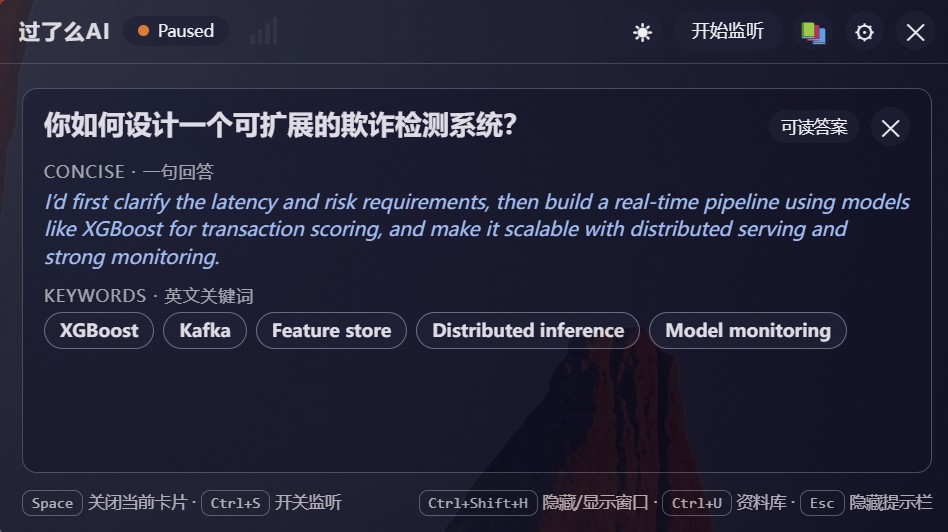
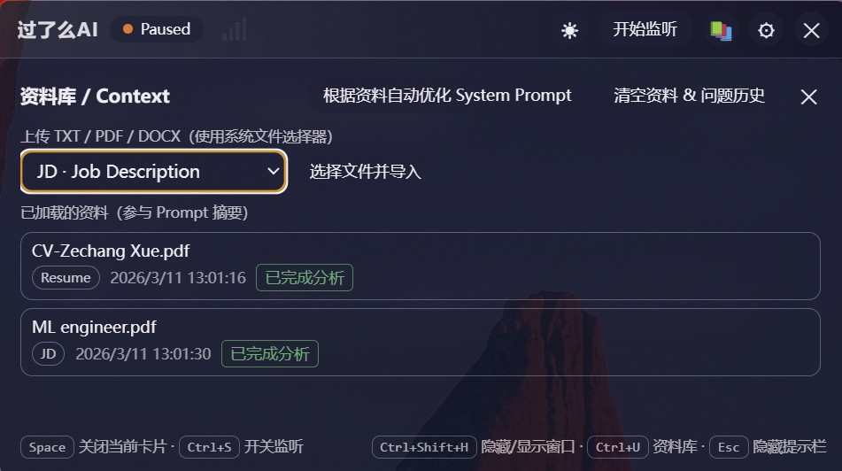
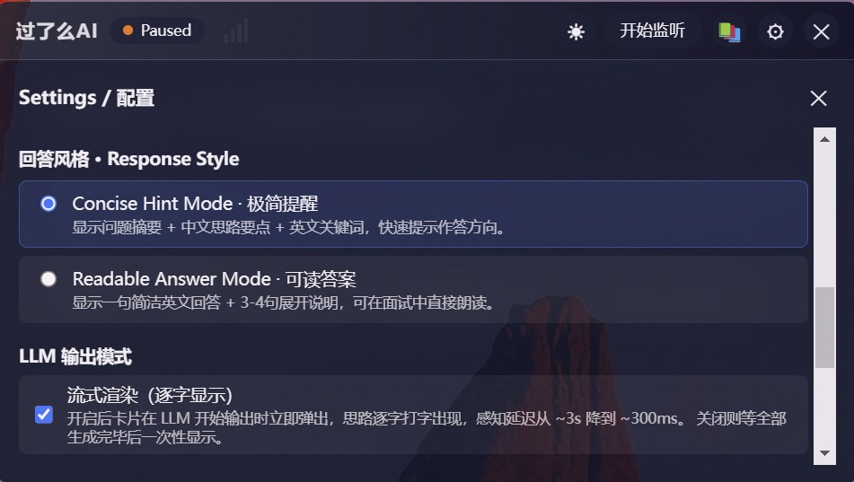

# 过了么AI — 实时面试 / 会议辅助工具

> **Windows 桌面应用** · Electron + React · GPT-4o Realtime 一体音频直通

面向各类岗位的实时面试辅助工具，同时支持**项目会议答疑模式**。  
以悬浮窗形式在桌面显示，监听对方的提问后自动给出精炼回答提词，帮你更从容地应对每一个问题。

支持中英文面试：在 Settings 顶部一键切换答案语言，中英文组会/面试均可使用。

---

## 核心功能

| 功能 | 说明 |
|---|---|
| **实时提词卡** | 监听问题后快速给出一句可朗读回答与关键词 |
| **可读答案模式** | 一句回答无缝展开为 3-4 句自然表达 |
| **中英文答案切换** | Settings 顶部一键切换，中文面试/组会同样适用 |
| **GPT-4o Realtime 一体模式** | 音频直接送入模型，省去 Whisper 中转，延迟 ~1s |
| **JD / 简历 / 笔记上下文融合** | 基于岗位要求和你的经历生成更贴合的回答思路 |
| **历史记忆与追问应对** | 结合近期问答历史，对追问进行自然衔接回答 |
| **会议 / 项目介绍模式** | 上传项目文档，根据文档内容实时答疑（支持 PDF / TXT / DOCX） |
| **下一题自动切换** | 识别到新一轮提问时自动收起旧卡、继续监听 |
| **一键导出复盘** | 将本次面试的问答记录导出为 PDF，附带 AI 生成的中文总结 |
| **多 AI 服务商** | 支持 OpenAI / Google Gemini / DeepSeek / 千问 / Ollama 本地 |
| **系统音频捕获** | WASAPI loopback 直接录制扬声器输出，不录麦克风 |

---

## 截图

| 提词卡界面 | 资料库 / Context | 设置 |
|:---:|:---:|:---:|
|  |  |  |

---

## 下载安装（Windows）

前往 [GitHub Releases](https://github.com/ZechangXue/ai_interview/releases) 下载最新版 `.exe` 安装包，双击安装即可。

当前版本：**v1.7.0**（Windows x64）

---

## 开发环境运行

### 环境要求

- Node.js >= 18
- Windows 10 x64 及以上（原生音频模块仅支持 Windows）

### 安装依赖

```bash
npm install
```

### 开发模式

```bash
npm run dev
```

同时启动 Vite 前端（端口 5173）和 Electron 主进程，支持热重载。

### 打包 Windows 安装包

```bash
npm run dist:win
```

产物输出到 `release/` 目录。

---

## 首次使用配置

### 1. 配置 API Key

应用使用 OpenAI API（或其他服务商），Key 通过系统 keychain 安全存储，不会写入任何文件。

1. 打开 [platform.openai.com/api-keys](https://platform.openai.com/api-keys) 创建 Key
2. 确保账户已绑卡并有可用额度（[Billing 页面](https://platform.openai.com/account/billing)）
3. 在应用 **Settings** 中粘贴 Key，点击「测试连接」确认通过

> ChatGPT Plus 订阅**不等于** API 额度已开通，需单独充值。

### 2. 推荐设置

- **答案语言**：Settings 顶部切换 English / 中文，中英文面试均可
- **服务商**：OpenAI，模型默认 `gpt-4.1-mini`
- **模式**：默认开启 GPT-4o Realtime 一体（音频直通，延迟最低）
- **回答风格**：极简提醒（Concise）日常使用；卡壳时切换可读答案
- **音频来源**：System Audio（监听对方声音）；自测时换 Microphone

### 3. 使用流程

1. 上传资料（JD / 简历 / 笔记），点击「根据资料自动优化」
2. 点击「开始监听」
3. 面试中先读一句回答，再按关键词展开；卡壳时切可读答案模式
4. 面试结束后点「一键导出」生成 PDF 复盘报告

---

## 快捷键

| 按键 | 操作 |
|---|---|
| `Space` | 关闭当前提词卡，继续监听 |
| `Ctrl + U` | 打开资料上传面板 |
| `Ctrl + S` | 开始 / 暂停监听 |
| `Esc` | 最小化悬浮窗（后台继续监听） |

---

## 会议 / 项目介绍模式

在 **Settings** 中开启「会议模式」，上传项目文档（支持 PDF / TXT / DOCX），模型会深度内化文档内容，根据与会者的提问实时给出有据可查的回答——适合技术评审、项目汇报、演示答疑等场景。

---

## 成本参考

一场约 30 分钟的面试，API 消耗通常约 **$0.30**（随模型与问答密度波动）。

---

## 技术栈

- **前端**：React 18 + TypeScript + Vite
- **桌面壳**：Electron 31
- **音频**：WASAPI loopback（`wasapi-loopback` 原生模块）/ PortAudio naudiodon
- **AI**：OpenAI Realtime API / Chat Completions / Whisper
- **存储**：Electron userData JSON + keytar（Key 安全存储）

---

## 本地存储说明

- **API Key**：通过 `keytar` 存入系统 keychain，不写入任何文件
- **设置 / 资料摘要 / 历史提问**：存放于 `app.getPath('userData')` 下的 JSON 文件，重启后保留

---

## License

MIT + Commons Clause — 个人 / 非商业用途免费；商业用途需联系作者授权。详见 [LICENSE](./LICENSE)。
